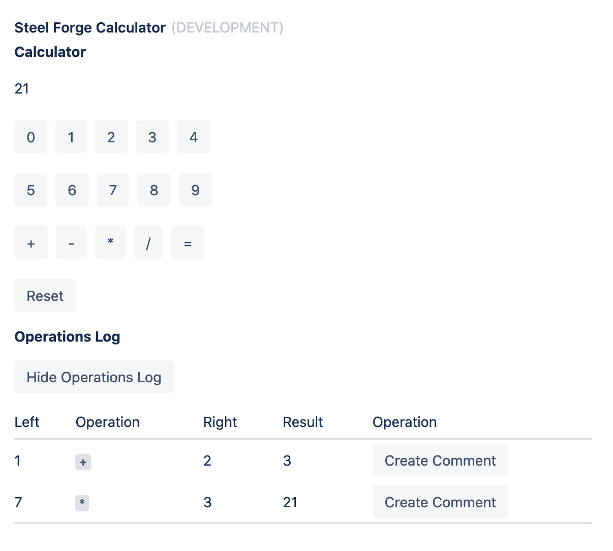

# Steel Forge Calculator Application

This project contains a Forge app written in Typescript that creates `Calculator` using [UI Hooks](https://developer.atlassian.com/platform/forge/ui-hooks-reference/)

For latest code base visit [BitBucket Repo](https://bitbucket.org/jangidd/forge-calculator)

## Screenshot

## Learning Forge

See [developer.atlassian.com/platform/forge/](https://developer.atlassian.com/platform/forge) for documentation and tutorials explaining Forge.

## Requirements

See [Set up Forge](https://developer.atlassian.com/platform/forge/set-up-forge/) for instructions to get set up.

## Quick start

- Build and deploy your app by running: `forge deploy`
- Install your app in an Atlassian site by running: `forge install`
- Develop your app by running `forge tunnel` to proxy invocations locally: `forge tunnel`

### Notes

- Use the `forge deploy` command when you want to persist code changes.
- Use the `forge install` command when you want to install the app on a new site.
- Once the app is installed on a site, the site picks up the new app changes you deploy without needing to rerun the install command.

## Support

- Reach me at [Attlassian Community Profile](https://community.atlassian.com/t5/user/viewprofilepage/user-id/690016)
- See [Get help](https://developer.atlassian.com/platform/forge/get-help/) for how to get help and provide feedback.

## License

Copyright (c) 2020 Deepak Jangid
MIL Licensed, see [LICENSE](LICENSE) file.
